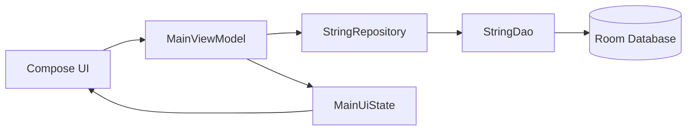

# アーキテクチャ

## 構成

画面は `MainUiState` を購読し、ユーザー操作をViewModelのメソッドへ渡す。ViewModelはRepositoryだけに依存し、RoomやDAOの実装詳細をUIへ公開しない。

## データフロー

1. Roomの変更をDAOが`Flow`として公開する
2. Repositoryがデータアクセスを抽象化する
3. ViewModelが一覧・挨拶・処理状態・エラーを`MainUiState`へまとめる
4. Compose UIが状態を描画し、操作結果をユーザーへ通知する

## 検証手順

| 目的 | コマンド |
| --- | --- |
| デバッグビルド | `.\gradlew.bat assembleDebug` |
| JVM単体テスト | `.\gradlew.bat testDebugUnitTest` |
| Lint | `.\gradlew.bat lintDebug` |
| 実機・エミュレーター | `.\gradlew.bat connectedAndroidTest` |

派生アプリでは、データ層の変更時にDAO/Databaseテストを追加し、画面操作の変更時にCompose UIテストを追加する。
